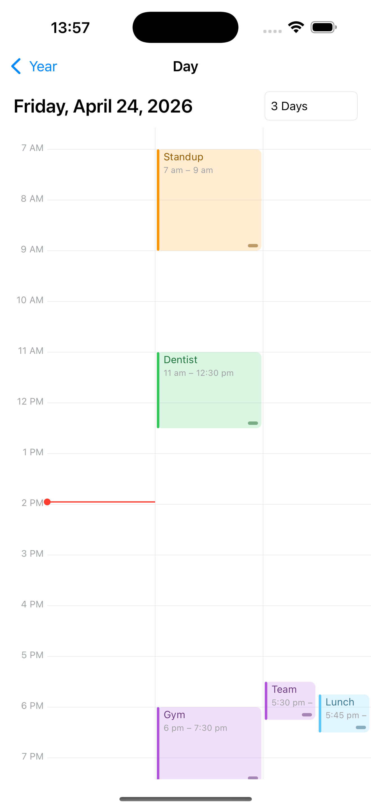

# Omnicasa.Schedule

Smooth calendar and agenda controls for .NET MAUI (iOS + Android), inspired by the iOS Calendar, Outlook, and Google Calendar apps.

The package ships two drop-in controls backed by a small, pluggable data-source abstraction:

- **`YearCalendarView`** — scrollable year-at-a-glance grid with 12 months per year and event-density dots.
- **`DayAgendaView`** — day / 3-day / 5-day / week agenda with horizontal swipe, pinch-to-zoom on the time rail, and tap / drag / resize on appointment blocks.

## Screenshots

| Year | Day | Multi-day |
| :--: | :--: | :--: |
|  |  |  |

## Targets

- `net9.0-android` (API 26+)
- `net9.0-ios18.0` (iOS 15+)
- .NET MAUI 9.0.120

## Install

```bash
dotnet add package Omnicasa.Schedule
```

## Quick start

Expose an `IAppointmentSource` to feed the controls:

```csharp
public sealed class MyAppointments : IAppointmentSource
{
    public event EventHandler<AppointmentsChangedEventArgs>? Changed;

    public Task<IReadOnlyList<Appointment>> GetAsync(
        DateTime from, DateTime to, CancellationToken ct = default)
    {
        // Return appointments overlapping [from, to]
    }
}
```

Year view:

```xml
<ContentPage xmlns:sched="clr-namespace:Omnicasa.Schedule;assembly=Omnicasa.Schedule">
    <sched:YearCalendarView x:Name="Year"
                            MinYear="2020"
                            MaxYear="2032"
                            InitialYear="2026"
                            DayTapped="OnDayTapped" />
</ContentPage>
```

Day / week view:

```xml
<sched:DayAgendaView x:Name="Day"
                     DaysPerPage="3"
                     HourHeight="60"
                     FirstDayOfWeek="Monday"
                     AppointmentTapped="OnAppointmentTapped"
                     AppointmentChanged="OnAppointmentChanged" />
```

```csharp
Year.AppointmentSource = new MyAppointments();
Day.AppointmentSource  = Year.AppointmentSource;
```

## Controls

### `YearCalendarView`

| Property | Default | Description |
| --- | --- | --- |
| `AppointmentSource` | `null` | Source used to compute per-day event-density dots. |
| `MinYear` / `MaxYear` | today ± 5 years | Inclusive range of years rendered. |
| `InitialYear` | current year | Year scrolled into view on first load. |
| `Theme` | built-in | `ScheduleTheme` color palette. |
| `DayTapped` event | — | Fires with a `DateOnly` when a day cell is tapped. |
| `ScrollToYear(year, animated)` | — | Programmatically scroll. |

### `DayAgendaView`

| Property | Default | Description |
| --- | --- | --- |
| `AppointmentSource` | `null` | Source the visible pages pull from. |
| `SelectedDate` | `DateTime.Today` | First date of the visible page (two-way). |
| `DaysPerPage` | `1` | Days side-by-side (1..7). When `7`, aligns to `FirstDayOfWeek`. |
| `FirstDayOfWeek` | `Monday` | Week-mode alignment. |
| `HourHeight` | `60` | Logical pixels per hour; clamped to `[24, 200]`, pinch to zoom. |
| `DayWindow` | `365` | Days swipable in each direction from the anchor. |
| `Theme` | built-in | `ScheduleTheme` palette. |
| `AppointmentTapped` event | — | Tap an appointment block. |
| `AppointmentChanged` event | — | Fired after a drag or resize commit. |

## Theming

Override colors via `ScheduleTheme` and assign it to any control:

```csharp
Day.Theme = new ScheduleTheme
{
    Accent     = Colors.DodgerBlue,
    Today      = Colors.DodgerBlue,
    GridLine   = Color.FromArgb("#E5E5EA"),
    Foreground = Colors.Black,
    Muted      = Color.FromArgb("#8E8E93"),
};
```

## Sample app

The repo contains a runnable sample under `samples/Omnicasa.Schedule.Sample` that wires both controls to an in-memory source of randomized appointments and navigates from year → day on tap.

```bash
# iOS
dotnet build samples/Omnicasa.Schedule.Sample -f net9.0-ios18.0 -t:Run

# Android
dotnet build samples/Omnicasa.Schedule.Sample -f net9.0-android -t:Run
```

## Repository layout

```
src/Omnicasa.Schedule/          # the library (YearCalendarView, DayAgendaView, …)
samples/Omnicasa.Schedule.Sample/  # MAUI demo app (iOS + Android)
screenshots/                    # images referenced above
```
