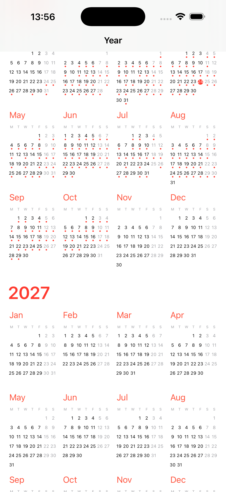
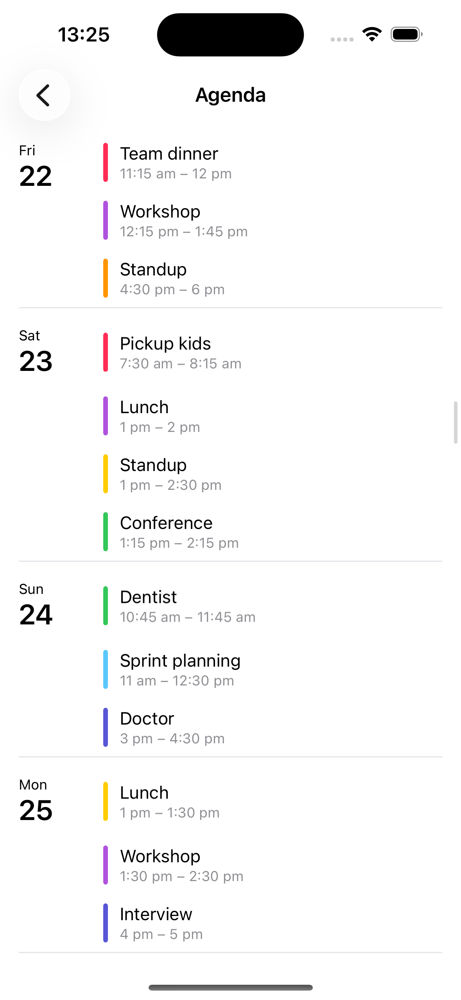
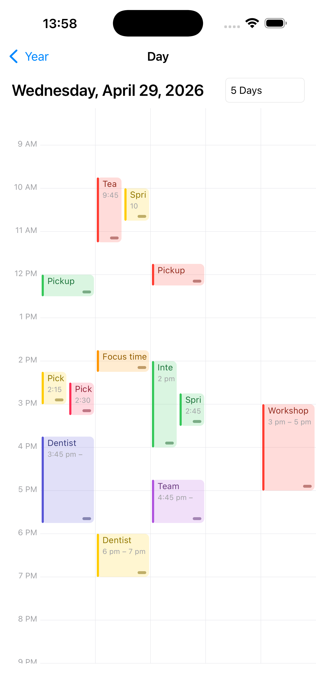
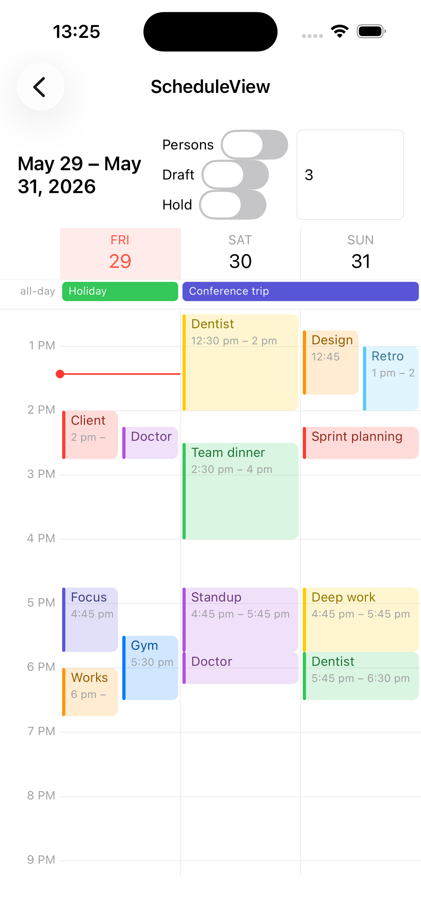
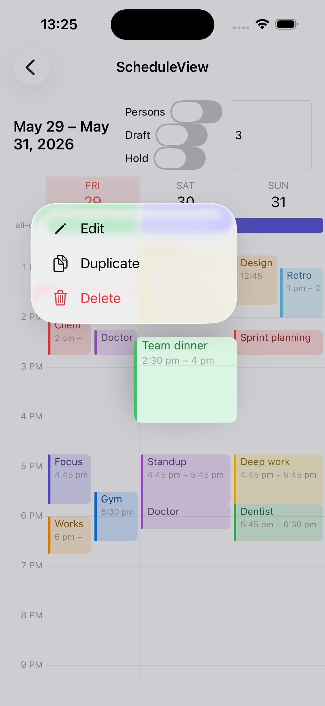
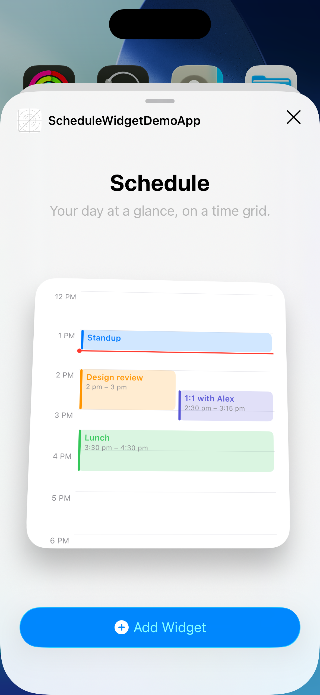

# Omnicasa.Schedule

[](https://www.nuget.org/packages/Omnicasa.Schedule)
[](https://www.nuget.org/packages/Omnicasa.Schedule)
[](LICENSE)

Smooth calendar and agenda controls for .NET MAUI (iOS + Android), inspired by the iOS Calendar, Outlook, and Google Calendar apps.

📦 **NuGet:** <https://www.nuget.org/packages/Omnicasa.Schedule>

The package ships six drop-in controls. Items are bound through small interfaces (`IScheduleItem`, `IPerson`) so you can implement them on your own models — nothing forces you onto the library's concrete types.

- **`ScheduleView`** — the core scheduler: a fixed `[StartDay, EndDay]` viewport (1–7 day columns), optional per-person sub-columns, an all-day / cross-date bar above the grid, pinch-to-zoom, tap / long-tap with date-time payloads, and a movable / resizable "typing" draft block.
- **`ScheduleHeaderView`** — the schedule's day/person header as a standalone bar, for pinning over a full-bleed schedule (iOS 26 liquid-glass style) or sharing one header across a `CarouselView` of day pages.
- **`DayAgendaView`** — day / 3-day / 5-day / week agenda with horizontal swipe between pages, pinch-to-zoom on the time rail, and tap / drag / resize on appointment blocks.
- **`AgendaListView`** — an infinitely-scrolling agenda: one row per day with the date on the left and that day's appointments on the right ("no events" placeholders for empty days), built on `CollectionView`.
- **`MonthCalendarView`** — full-size months stacked vertically with continuous scroll (one month per screen), event-density dots, and per-day tap. Pairs with the year view for a year → month → day drill-down.
- **`YearCalendarView`** — scrollable year-at-a-glance grid with 12 months per year and event-density dots.

## Screenshots

| Year |                     Day                     | Multi-day |
| :--: |:-------------------------------------------:| :--: |
|  |  |  |

|                 Cross-dates                 |                  Quick-actions                   |                Widget                 |
|:-------------------------------------------:|:------------------------------------------------:|:-------------------------------------:|
|  |  |      |
## Targets

- `net9.0-android` (API 26+)
- `net9.0-ios18.0` (iOS 15+)
- .NET MAUI 9.0.120

## Install

```bash
dotnet add package Omnicasa.Schedule
```

Or via the [NuGet package page](https://www.nuget.org/packages/Omnicasa.Schedule).

## Quick start — `ScheduleView`

Implement `IScheduleItem` on your own appointment model:

```csharp
public sealed class MyItem : IScheduleItem
{
    public string Id { get; init; } = Guid.NewGuid().ToString();
    public string? Title { get; init; }
    public DateTime Start { get; init; }
    public DateTime End { get; init; }
    public bool IsAllDay => false;
    public Color? Color { get; init; }
    public string? PersonId { get; init; }   // links to an IPerson when persons are bound
    public string? Notes { get; init; }
}
```

Optionally implement `IPerson` (or use the built-in `Person`) to split each day into one column per person:

```csharp
IList<IPerson> persons = new List<IPerson>
{
    new Person { Id = "p1", Name = "Alice", Color = Colors.DodgerBlue },
    new Person { Id = "p2", Name = "Bob",   Color = Colors.MediumSeaGreen },
};
```

Bind it in XAML:

```xml
<ContentPage xmlns:sched="clr-namespace:Omnicasa.Schedule;assembly=Omnicasa.Schedule">
    <sched:ScheduleView StartDay="{Binding StartDay}"
                        EndDay="{Binding EndDay}"
                        ViewMode="{Binding ViewMode}"
                        Persons="{Binding Persons}"
                        ItemsSource="{Binding Items}"
                        TypingItem="{Binding TypingItem}"
                        Tapped="OnTapped"
                        LongTapped="OnLongTapped"
                        ItemTapped="OnItemTapped"
                        ItemLongTapped="OnItemLongTapped" />
</ContentPage>
```

## Quick start — `DayAgendaView` / `YearCalendarView`

These two pull from an `IAppointmentSource`:

```csharp
public sealed class MyAppointments : IAppointmentSource
{
    public event EventHandler<AppointmentsChangedEventArgs>? Changed;

    public Task<IReadOnlyList<Appointment>> GetAsync(
        DateTime from, DateTime to, CancellationToken ct = default)
    {
        // Return appointments overlapping [from, to]
    }
}
```

```xml
<sched:YearCalendarView x:Name="Year"
                        MinYear="2020" MaxYear="2032" InitialYear="2026"
                        DayTapped="OnDayTapped" />

<sched:DayAgendaView x:Name="Day"
                     DaysPerPage="3" HourHeight="60" FirstDayOfWeek="Monday"
                     AppointmentTapped="OnAppointmentTapped"
                     AppointmentChanged="OnAppointmentChanged" />
```

```csharp
Year.AppointmentSource = new MyAppointments();
Day.AppointmentSource  = Year.AppointmentSource;
```

> `Appointment` implements `IScheduleItem`, so the same instances can feed `ScheduleView` too.

## Controls

### `ScheduleView`

| Property | Default | Description |
| --- | --- | --- |
| `ItemsSource` | `null` | Any `IEnumerable` of objects implementing `IScheduleItem`. All-day and cross-date (multi-day) items render in an **all-day panel** above the grid, spanning the days they cover; everything else is an intraday block. |
| `StartDay` / `EndDay` | today / +6 days | Inclusive viewport range. |
| `ViewMode` | `7` | Max columns shown (1–7); range is capped to this. |
| `HourHeight` | `60` | Logical pixels per hour; clamped to `[24, 200]`, pinch to zoom. |
| `Persons` | `null` | `IList<IPerson>`; when non-empty each day splits into one column per person. |
| `TypingItem` | `null` | An `ITypingScheduleItem` draft block — shadowed, draggable, resizable (snaps to grid). |
| `HoldingSchedule` | `null` | An `IScheduleItem` "held" block — drag to move (free vertical, snap to column) and resize via corner handles. Reports drops via `HoldingDropped`; never mutates the item. |
| `VerticalOffset` | `0` | Two-way scroll offset (pixels). Bind several pages to one value to keep a `CarouselView` of schedules in sync. |
| `HeaderMode` | `Inhouse` | Where the day header (and all-day panel) renders: `Inhouse` (pinned inside the control), `Linked` (suppressed — an external [`ScheduleHeaderView`](#scheduleheaderview) draws them), `None` (no header; all-day panel stays). |
| `TopContentInset` | `0` | Blank space above midnight inside the scrollable body. Use with `Linked` + an overlaid header so hour 0 starts below the glass bar while content scrolls under it. |
| `Theme` | built-in | `ScheduleViewTheme` (colors **and** font sizes). |
| `Renderer` | built-in | `ScheduleViewRenderer` — see [Custom rendering](#custom-rendering). |
| `ItemActionsProvider` | `null` | `Func<IScheduleItem, IReadOnlyList<ScheduleMenuAction>>`; return actions (label + optional icon) to show a native long-press menu (iOS context menu / Android `PopupMenu`). |
| `Tapped` / `LongTapped` | — | Empty-space tap; payload is the `DateTime` at the tap. |
| `ItemTapped` / `ItemLongTapped` | — | Block tap; payload is the `IScheduleItem`. |
| `ItemActionInvoked` | — | Fires with the chosen action label from the long-press menu. |
| `HoldingDropped` | — | Fires when the held block is released; payload is `Item`, snapped `Start`/`End`, `PersonId`. |

`ScrollToTimeAsync(timeOfDay, animated)` programmatically scrolls a time to the top.

### `ScheduleHeaderView`

A standalone day/person header bar for pinning **outside** the schedule — e.g. a translucent, iOS 26
liquid-glass style bar the full-bleed schedule scrolls under, or a single header shared by a
`CarouselView` of day pages (an in-house header would swipe away with its page).

| Property | Default | Description |
| --- | --- | --- |
| `Schedule` | `null` | **Linked mode**: the `ScheduleView` to mirror (set its `HeaderMode="Linked"`). Columns, theme, renderer and all-day bars come from that view; the header also tracks its scroll for the edge shadow. With a carousel, re-point this at the current page as it changes. |
| `StartDay` / `EndDay` / `ViewMode` / `Persons` / `Theme` / `Renderer` | as `ScheduleView` | **Standalone mode** (when `Schedule` is null): bind these to the same source as the schedule; columns are built with identical rules so they align. |
| `ShowAllDay` | `true` | Render the all-day / cross-date panel below the day bar (linked mode only). |
| `HeaderBackground` | `null` | View layered behind the canvases — typically a platform blur / glass view. Setting it makes the header paint on a transparent background. |
| `DrawsBackground` | `true` | Set `false` to skip the opaque theme background without a background view. |
| `ScrollOffset` | `0` | Drives the scroll-edge shadow; auto-tracks the linked schedule's `VerticalOffset`. |
| `ShowsScrollEdgeShadow` | `true` | Soft shadow under the bar once content is scrolled beneath it. |
| `ItemTapped` event | — | Tap on an all-day bar. |

```csharp
// One glass header pinned over a full-bleed carousel of day pages:
var header = new ScheduleHeaderView { VerticalOptions = LayoutOptions.Start, HeaderBackground = blurView };
var page = new ScheduleView { HeaderMode = ScheduleHeaderMode.Linked, TopContentInset = 48 };
header.Schedule = page; // re-point on carousel page change
Content = new Grid { Children = { carousel, header } };
```

See `samples/.../GlassSchedulePage.cs` for the full pattern (carousel re-linking, inset sizing, iOS blur).
The header must get the same width and horizontal insets as the schedule body for the columns to align.

### `DayAgendaView`

| Property | Default | Description |
| --- | --- | --- |
| `AppointmentSource` | `null` | Source the visible pages pull from. |
| `SelectedDate` | `DateTime.Today` | First date of the visible page (two-way). |
| `DaysPerPage` | `1` | Days side-by-side (1..7). When `7`, aligns to `FirstDayOfWeek`. |
| `FirstDayOfWeek` | `Monday` | Week-mode alignment. |
| `HourHeight` | `60` | Logical pixels per hour; clamped to `[24, 200]`, pinch to zoom. |
| `DayWindow` | `365` | Days swipable in each direction from the anchor. |
| `Persons` | `null` | `IList<IPerson>`; one column per person. |
| `Theme` | built-in | `ScheduleTheme` palette. |
| `Renderer` | built-in | `DayAgendaRenderer` — see [Custom rendering](#custom-rendering). |
| `AppointmentTapped` event | — | Tap an appointment block. |
| `AppointmentChanged` event | — | Fired after a drag or resize commit. |

### `AgendaListView`

| Property | Default | Description |
| --- | --- | --- |
| `ItemsSource` | `null` | `IEnumerable` of `IScheduleItem`; grouped by day. |
| `AnchorDate` | today | Day the list is centered on when first built. |
| `EmptyDayText` | `"No events"` | Placeholder text shown on days with no items. |
| `ShowEmptyDays` | `true` | Render a "no events" placeholder row for empty days; `false` skips them. |
| `LimitToItemsSource` | `false` | Clamp the infinite scroll to the items' date range (first start … last end); `false` scrolls forever. |
| `ItemTemplate` | built-in | `DataTemplate` for one appointment on the right (binds to `AgendaEntry`). |
| `DateTemplate` | built-in | `DataTemplate` for the date column on the left (binds to `AgendaRow`). |
| `Theme` | built-in | `ScheduleTheme` for the default templates. |
| `InitialBackDays` / `InitialForwardDays` / `PageSize` | 14 / 30 / 14 | Window sizing and the increment loaded at each edge. |
| `ItemTapped` event | — | Tap an appointment; payload is the `IScheduleItem` (placeholders ignored). |
| `ScrollToDate(date, animated)` | — | Scroll a day to the top (loads it into the window first). |

The date sits on the left, that day's appointments on the right (the date renders once per day; the current day stays pinned at the top-left). Multi-day items appear on every day they span; the list extends infinitely as you scroll up/down. Internally it's a flat, fully-virtualized `CollectionView` (one row per appointment), which keeps scrolling smooth.

Since this is a `CollectionView`, not a canvas, customization is via **`DataTemplate`s** rather than a `Renderer`:

```xml
<sched:AgendaListView ItemsSource="{Binding Items}" ItemTapped="OnItemTapped">

    <!-- appointment cell (right); binds to AgendaEntry: Title, TimeText, Accent, ShowAccent, Item -->
    <sched:AgendaListView.ItemTemplate>
        <DataTemplate x:DataType="sched:AgendaEntry">
            <Label Text="{Binding Title}" />
        </DataTemplate>
    </sched:AgendaListView.ItemTemplate>

    <!-- date column (left); binds to AgendaRow: WeekdayText, DayNumberText, HeaderColor, Date, ShowDate -->
    <sched:AgendaListView.DateTemplate>
        <DataTemplate x:DataType="sched:AgendaRow">
            <Label Text="{Binding DayNumberText}" TextColor="{Binding HeaderColor}" FontSize="24" />
        </DataTemplate>
    </sched:AgendaListView.DateTemplate>

</sched:AgendaListView>
```

`ItemTapped` keeps firing with a custom `ItemTemplate` (the tap is on the whole row, not the default cell). Both templates are materialized once per pooled row — keep them shallow for smooth scrolling.

### `MonthCalendarView`

| Property | Default | Description |
| --- | --- | --- |
| `AppointmentSource` | `null` | Source used to compute per-day event-density dots. |
| `MinYear` / `MaxYear` | today ± 5 years | Inclusive range of months rendered. |
| `InitialDate` | today | Month scrolled into view on first load. |
| `Theme` | built-in | `ScheduleTheme` (colors + optional fonts). |
| `Renderer` | built-in | `MonthRenderer` — see [Custom rendering](#custom-rendering). |
| `DayTapped` event | — | Fires with a `DateOnly` when a day cell is tapped. |
| `ScrollToMonth(year, month, animated)` | — | Programmatically scroll. |

### `YearCalendarView`

| Property | Default | Description |
| --- | --- | --- |
| `AppointmentSource` | `null` | Source used to compute per-day event-density dots. |
| `MinYear` / `MaxYear` | today ± 5 years | Inclusive range of years rendered. |
| `InitialYear` | current year | Year scrolled into view on first load. |
| `Theme` | built-in | `ScheduleTheme` (colors + optional fonts). |
| `Renderer` | built-in | `MonthRenderer` — see [Custom rendering](#custom-rendering). |
| `DayTapped` event | — | Fires with a `DateOnly` when a day cell is tapped. |
| `ScrollToYear(year, animated)` | — | Programmatically scroll. |

## Theming

Override colors (and, for `ScheduleView`, font sizes) via the theme object and assign it to any control:

```csharp
Day.Theme = new ScheduleTheme
{
    Accent     = Colors.DodgerBlue,
    Today      = Colors.DodgerBlue,
    GridLine   = Color.FromArgb("#E5E5EA"),
    Foreground = Colors.Black,
    Muted      = Color.FromArgb("#8E8E93"),
};
```

The calendar views (`MonthCalendarView` / `YearCalendarView`) also read **font** and **size** from `ScheduleTheme`. Font sizes are nullable — leave them `null` to auto-fit each cell, or set a value to pin it:

```csharp
Month.Theme = new ScheduleTheme
{
    Accent             = Colors.DodgerBlue,
    Today              = Colors.DodgerBlue,
    FontFamily         = "OpenSans-Regular",   // null = platform default
    MonthHeaderFontSize = 24,                   // null = auto-fit
    WeekdayFontSize     = 14,
    DayNumberFontSize   = 18,
};
```

## Custom rendering

Theming only changes colors and fonts. When you need **different appointment types to draw differently** (or want to restyle headers, the hour grid, the today marker, the draft block, the held block, or day cells), override the renderer. `ScheduleView`, `DayAgendaView`, and the calendar views (`MonthCalendarView` / `YearCalendarView`) each expose a `Renderer` property; subclass the matching renderer base and override only the primitives you need — every other primitive keeps the built-in look.

The most common case is per-type appointment drawing: override `DrawAppointment`, switch on your concrete model type, and call `base` for the default look.

```csharp
public sealed class MyRenderer : ScheduleViewRenderer
{
    public override void DrawAppointment(ScheduleAppointmentContext ctx)
    {
        switch (ctx.Item)
        {
            case MeetingItem:
                // paint into ctx.Rect with ctx.Canvas, using ctx.BlockColor / ctx.Theme
                ctx.Canvas.FillColor = ctx.BlockColor;
                ctx.Canvas.FillRoundedRectangle(ctx.Rect, 10);
                break;

            case LeaveItem:
                // a different look for a different type…
                break;

            default:
                base.DrawAppointment(ctx);   // fall back to the built-in block
                break;
        }
    }

    // Other overridable primitives (defaults reproduce the built-in look):
    //   DrawHeader, DrawHeaderBackground, DrawHourGrid, DrawColumnSeparators,
    //   DrawTodayMarker, DrawTypingItem, DrawHoldingItem, DrawAllDayItem, DrawBackground
}
```

```xml
<sched:ScheduleView Renderer="{Binding MyRenderer}" ItemsSource="{Binding Items}" />
```

The calendar views use the same pattern via `MonthRenderer`. Override `DrawDay` (the common case), `DrawWeekday`, or `DrawHeader`:

```csharp
public sealed class MyMonthRenderer : MonthRenderer
{
    public override void DrawDay(MonthDayContext ctx)
    {
        if (ctx.Date.Day == 1)
        {
            // custom first-of-month look using ctx.Canvas / ctx.Rect / ctx.Theme / ctx.TextColor
        }
        else
        {
            base.DrawDay(ctx);   // built-in number + today highlight + density dot
        }
    }
}

// Month.Renderer = new MyMonthRenderer();  // also on YearCalendarView and MonthGraphicsView
```

Notes:

- `DayAgendaView` works the same way via `DayAgendaRenderer`; its `DayAgendaAppointmentContext` also exposes `IsGhost` (the drag ghost), `ShowResizeHandle`, and `FontScale`.
- `MonthDayContext` carries `Date`, `IsToday`, `EventCount`, the resolved `TextColor` / `FontSize` / `Font`, and `Compact`.
- `ScheduleTypingContext` / `ScheduleHoldingContext` carry the live `Item`, `Rect`, `BlockColor`, `Theme`; the holding one adds `DisplayStart` / `DisplayEnd` (current drag times) and `IsDragging`.
- Geometry and hit-testing stay inside the controls, so custom drawing can never desync tap / drag / resize regions — you only control the pixels inside the supplied `Rect`.
- Leaving `Renderer` unset uses the shared default (`ScheduleViewRenderer.Default` / `DayAgendaRenderer.Default` / `MonthRenderer.Default`).

## Appointment long-press menu (`ItemActionsProvider`)

Return a list of `ScheduleMenuAction`s for an appointment and a long-press shows a **native** menu — an iOS context menu (with the lifted block preview) or an Android `PopupMenu`. The chosen action's `Label` comes back via `ItemActionInvoked`:

```csharp
schedule.ItemActionsProvider = item => new[]
{
    new ScheduleMenuAction("Edit", icon: "pencil"),
    new ScheduleMenuAction("Duplicate", icon: "doc.on.doc"),
    new ScheduleMenuAction("Delete", icon: "trash", isDestructive: true),
};

schedule.ItemActionInvoked += (_, e) =>
{
    // e.Item, e.Action  — the appointment and the chosen label
};
```

`ScheduleMenuAction` = `Label` + optional `Icon` + `IsDestructive`. **Icons are platform-named:** on iOS the `Icon` is an **SF Symbol** name (`"trash"`), on Android a **drawable resource** name (`"ic_delete"`); unresolved names are ignored. `IsDestructive` styles the item red on iOS. For icons on both platforms, branch in your provider:

```csharp
icon: DeviceInfo.Platform == DevicePlatform.iOS ? "trash" : "ic_delete"
```

## Reschedule by dragging (`HoldingSchedule`)

Set `HoldingSchedule` to any `IScheduleItem` and it's drawn as a floating block: drag it (free vertically, snapped to the nearest column) and resize it via the corner handles. On release it raises `HoldingDropped` — the control **does not** mutate the item, so your handler decides whether to apply the change:

```csharp
schedule.HoldingDropped += (_, e) =>
{
    // e.Item, e.Start, e.End, e.PersonId  — the snapped drop result
    if (e.Item is Appointment a)
    {
        a.Start = e.Start;     // INotifyPropertyChanged → the block re-renders in place
        a.End = e.End;
        a.PersonId = e.PersonId;
    }
};
```

If you don't apply it, the block springs back to its original position (the gesture is reported, not committed).

## Sample app

The repo contains a runnable sample under `samples/Omnicasa.Schedule.Sample` that wires the controls to an in-memory source of randomized appointments and drills down year → month → day with an animated zoom on tap.

```bash
# iOS
dotnet build samples/Omnicasa.Schedule.Sample -f net9.0-ios18.0 -t:Run

# Android
dotnet build samples/Omnicasa.Schedule.Sample -f net9.0-android -t:Run
```

## Repository layout

```
src/Omnicasa.Schedule/             # the library (ScheduleView, DayAgendaView, YearCalendarView, …)
samples/Omnicasa.Schedule.Sample/  # MAUI demo app (iOS + Android)
tests/Omnicasa.Schedule.Tests/     # xUnit unit tests (net9.0)
screenshots/                       # images referenced above
```

## License

Licensed under the [MIT License](LICENSE) — © 2026 Hoang Quach (Omnicasa). You're free to use, modify, and distribute it, including commercially, provided the copyright notice and license text are retained.
